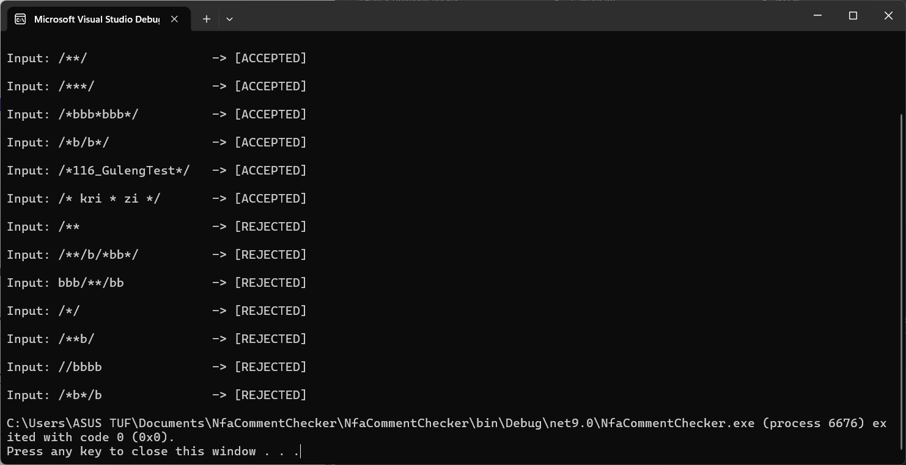

# NFA C-Style Block Comment Checker

This project implements a **Nondeterministic Finite Automaton (NFA)** to evaluate and validate C-style block comments (`/* ... */`). It includes both the theoretical handwritten solution and the C# implementation built using **Visual Studio 2022**.

## Handwritten Work (Bond Paper)

## Program Execution Output

