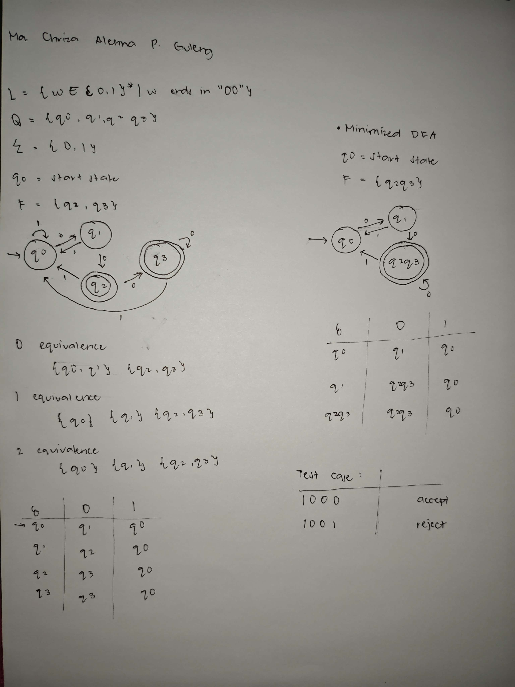
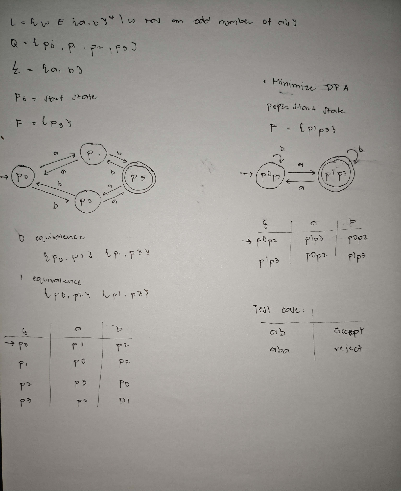
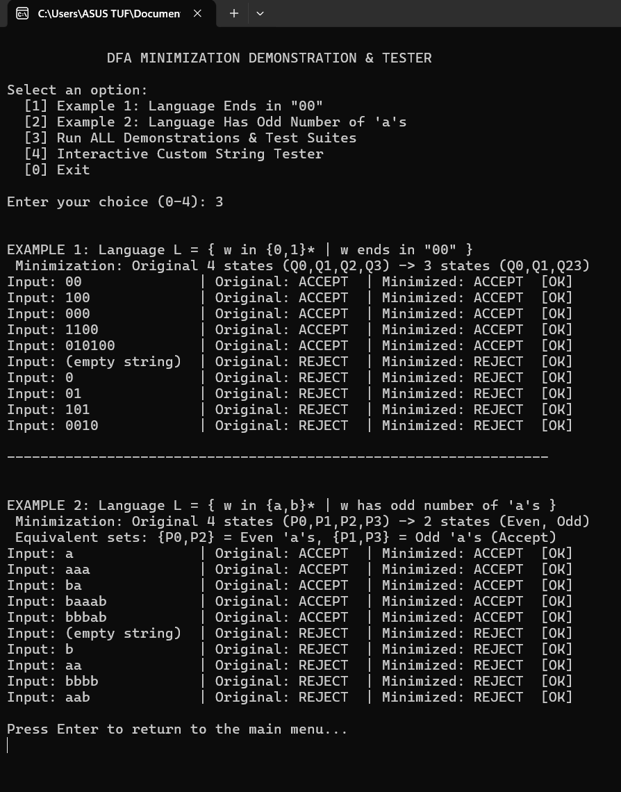
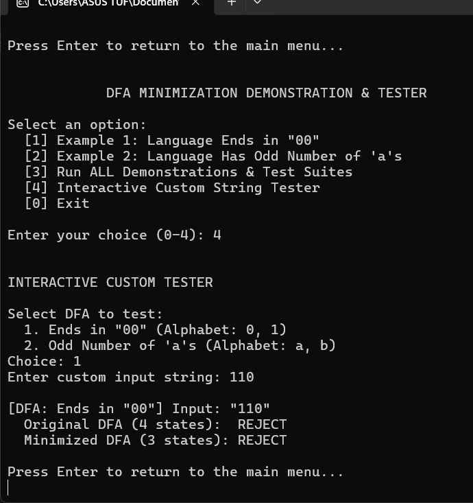

# DFA Minimization Demonstration & Tester

This project implements **DFA Minimization** to demonstrate how equivalent states in a Deterministic Finite Automaton can be merged to produce a minimized DFA. It includes both the theoretical handwritten solutions and the C# implementation built using **Visual Studio 2022**.

## Examples
- **Example 1:** Language Ends in "00" (4 States → 3 States)
- **Example 2:** Language Has Odd Number of 'a's (4 States → 2 States)

## Handwritten Work (Bond Paper)
# Example 1:

# Example 2:

## Program Execution Output
# Examples Output:

# Custom Tester Ouput:
